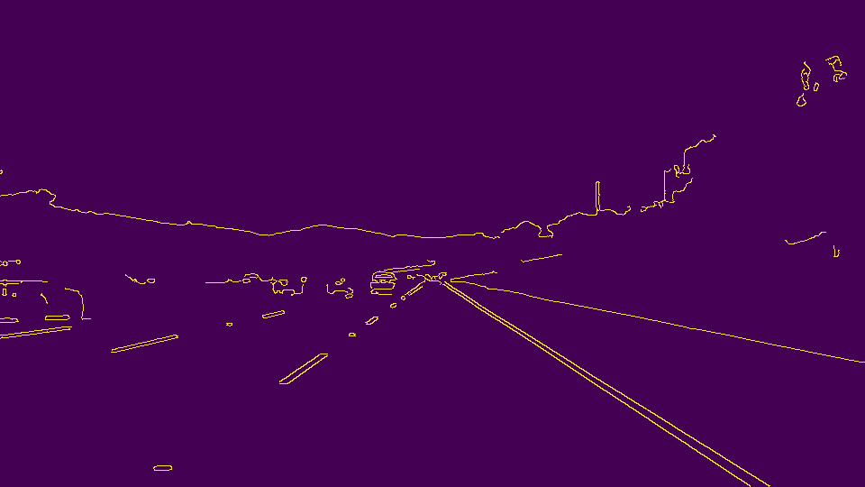
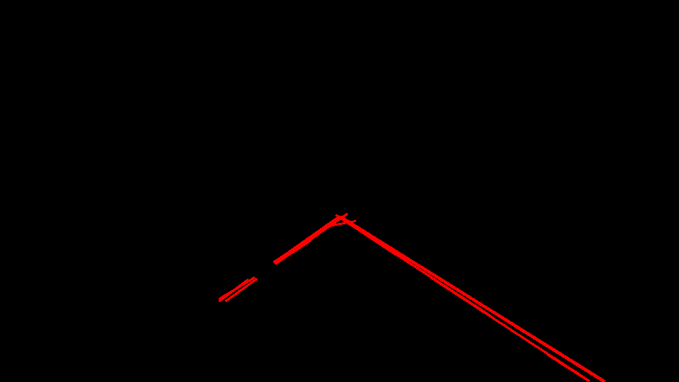
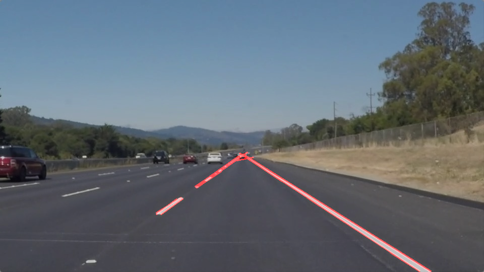

# **Finding Lane Lines on the Road** 

## Writeup Template


### Setup Python Environment
Most of time, i use python on linux system. In order to use jupyter on my mac,

so i have to setup my python environment

#### Install Anaconda
```bash
cd ~/Download
wget https://repo.continuum.io/archive/Anaconda3-4.4.0-MacOSX-x86_64.sh
bash Anaconda3-4.4.0-MacOSX-x86_64.sh
```

#### Clone Project
```bash
cd ~/workspace
### clone start kit, test python package
git clone https://github.com/udacity/CarND-Term1-Starter-Kit-Test.git

### clone project 1
git clone https://github.com/udacity/CarND-LaneLines-P1.git
```

#### Install Local Python Env
Because i use python3, but i found that start-kit use python2 as default.

install opencv, tensorflow and so on

```bash
conda create -n carnd-term1 python=2 anaconda
conda install -c conda-forge tensorflow

brew tap homebrew/science
brew install opencv
conda install -c menpo opencv
```

### You can use this file as a template for your writeup if you want to submit it as a markdown file. But feel free to use some other method and submit a pdf if you prefer.

---

**Finding Lane Lines on the Road**

The goals / steps of this project are the following:
* Make a pipeline that finds lane lines on the road
* Reflect on your work in a written report


[//]: # (Image References)

[image1]: ./examples/grayscale.jpg "Grayscale"

---

### Reflection

### 1. Describe your pipeline. As part of the description, explain how you modified the draw_lines() function.

My pipeline consistend of 5 steps, i test each step within single cell in jupyter.

then wrap all steps into class. see my jupyter notebook for detail(pipeline method in LaneFinding class).

#### 1. Converted the image to grayscale
Converted the image to grascale with help function: grayscale


#### 2. Applied Gaussian Blur to image
This step just call help function: guassian_blur with kernel size equal 5


#### 3. Canny Edge Detection
Canny Edge Detection with low threshold equal 60, high threshold equal 200



#### 4. Get ROI area
define roi with help function region_of_interest


#### 5.Using the Hough Transform to Find Lines from Canny Edges



#### 6.Draw Line on image with weighted




### 2. Identify potential shortcomings with your current pipeline


1. Current pipeline can't deal with contition that lane on road isn't a straight line;

2. I fixed all paramters in my class, not robust sometime;


### 3. Suggest possible improvements to your pipeline

1. About question 1, i use sklearn polynomial regression to fit lane;

2. Use more advanced method to setup params, for example ROI's prarmeter.
